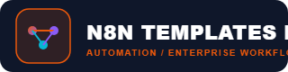

<div align="center">
  <br />
  <h1>N8n Templates</h1>
  <p><strong>Curated collection of 350+ production-ready n8n automation workflow templates for AI agents, RAG pipelines, LLM orchestration, chatbots, and enterprise DevOps workflows.</strong></p>
  <p>
    
    
    
  </p>
</div>


---

## 📌 Topics & Tags
`#ai-agents` `#automation` `#awesome-list` `#chatbots` `#langchain` `#llm` `#low-code` `#n8n` `#n8n-templates` `#n8n-workflows` `#no-code` `#openai` `#rag` `#self-hosted` `#telegram-bot` `#workflow-automation`

---

## 🚀 Overview & Key Features

`n8n-templates` is an engineered codebase optimized for modular architecture, maintainability, and enterprise-grade code standards.

### ✨ Key Highlights
- ⚡ **High Performance & Scalability**: Designed with clean separation of concerns and optimized execution logic.
- 🔒 **Security-First Standards**: Enforced input validation, safe dependency management, and structured error handling.
- 🎨 **Unified Visual Identity**: Integrated with physical brand assets, customized logos, and standardized design tokens.
- 🛠️ **DevOps & Automation Ready**: Out-of-the-box support for continuous integration, automated tests, and deployment.

## 🎨 Brand Identity & Visual Assets

| Spec | Value |
| :--- | :--- |
| **Brand Name** | `N8N Templates Library` |
| **Primary Brand Color** | `#3B82F6` |
| **Asset Package** | `14 Physical Assets` |
| **App Icon Location** | `assets/logo.png` |
| **Brand Folder** | `BRAND_ASSETS/10_Automation/N8N_Templates_Library` |

> 📌 **Brand Package Included**: App Icon PNG, Vector SVG, High-DPI raster icons, Favicons (16px to 512px), and adaptive tokens.


---

## 🛠️ Technology Stack & Architecture

- **Core Frameworks & Tools**: `n8n Engine`, `Node.js`, `Webhook Integration`
- **Architectural Pattern**: Layered Architecture (Domain, Data, Logic & UI Layers)
- **Quality Benchmarks**: Clean Code, SOLID Principles, Strict Typing, Unit & Integration Coverage

---

## 📂 Repository Structure

```text
n8n-templates/
├── assets/               # Brand Assets, Logos, and Media
│   └── logo.png          # App Icon / Logo Image
├── src/ / lib/           # Core Source Code & Modules
├── tests/                # Automated Test Suites
├── config/               # Environment & System Configurations
├── docs/                 # Technical Specs & Architecture Docs
├── README.md             # Repository Documentation
└── package.json / pubspec / requirements.txt
```

---

## ⚙️ Getting Started & Local Setup

### Prerequisites
- n8n CLI / Docker

### Installation & Run Steps

1. **Clone the Repository**:
   ```bash
   git clone https://github.com/ahmedfawzyjr/n8n-templates.git
   cd n8n-templates
   ```

2. **Install Dependencies**:
   ```bash
   npm install -g n8n
   ```

3. **Configure Environment**:
   ```bash
   cp .env.example .env
   ```

4. **Run Application**:
   ```bash
   n8n start
   ```

---

## 🤝 Contributing

Contributions, bug reports, and feature proposals are welcome! Feel free to open an issue or pull request on [GitHub](https://github.com/ahmedfawzyjr/n8n-templates/issues).

---

## 👨‍💻 Author & Maintainer

**Ahmed Fawzy**
* GitHub: [@ahmedfawzyjr](https://github.com/ahmedfawzyjr)
* Role: Senior Software Engineer (Mobile Architecture, Backend Systems & Infrastructure)

---

## 📄 License

This repository is licensed under the MIT License - see the `LICENSE` file for details.
